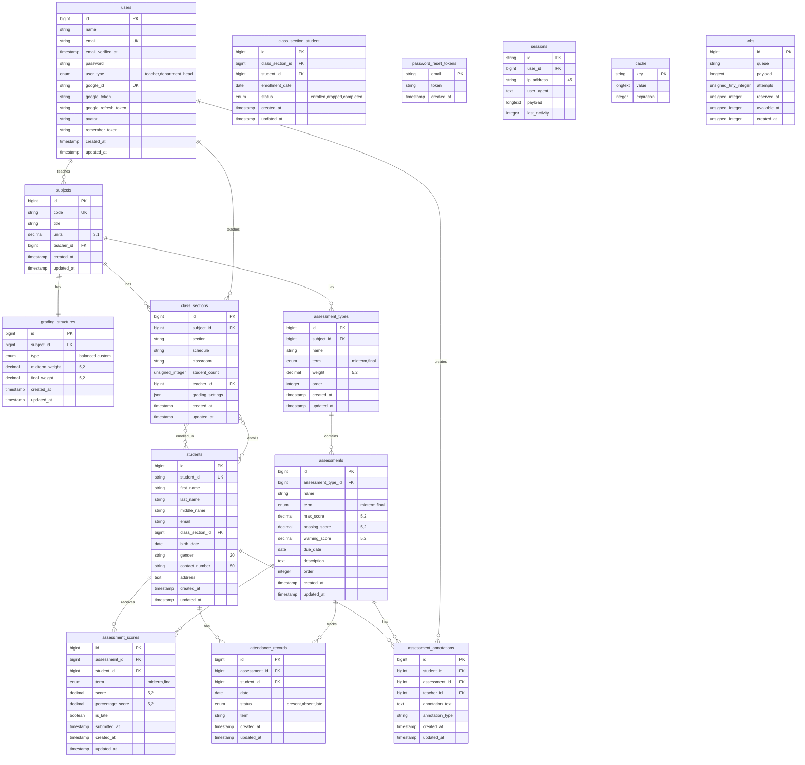

# GRAIL V3 Database Schema

## Complete Database Schema Diagram



## Simplified Schema Diagram (Alternative)

If the above diagram doesn't render properly, here's a simplified version:

```mermaid
erDiagram
    users {
        id PK
        name
        email UK
        user_type
        google_id UK
        created_at
        updated_at
    }

    subjects {
        id PK
        code UK
        title
        units
        teacher_id FK
        created_at
        updated_at
    }

    grading_structures {
        id PK
        subject_id FK
        type
        midterm_weight
        final_weight
        created_at
        updated_at
    }

    assessment_types {
        id PK
        subject_id FK
        name
        term
        weight
        order
        created_at
        updated_at
    }

    class_sections {
        id PK
        subject_id FK
        section
        schedule
        teacher_id FK
        grading_settings
        created_at
        updated_at
    }

    students {
        id PK
        student_id UK
        first_name
        last_name
        email
        created_at
        updated_at
    }

    assessments {
        id PK
        assessment_type_id FK
        name
        term
        max_score
        passing_score
        warning_score
        created_at
        updated_at
    }

    assessment_scores {
        id PK
        assessment_id FK
        student_id FK
        score
        percentage_score
        is_late
        created_at
        updated_at
    }

    assessment_annotations {
        id PK
        student_id FK
        assessment_id FK
        teacher_id FK
        annotation_text
        created_at
        updated_at
    }

    attendance_records {
        id PK
        assessment_id FK
        student_id FK
        date
        status
        term
        created_at
        updated_at
    }

    class_section_student {
        id PK
        class_section_id FK
        student_id FK
        enrollment_date
        status
        created_at
        updated_at
    }

    %% Relationships
    users ||--o{ subjects : "teaches"
    users ||--o{ class_sections : "teaches"
    users ||--o{ assessment_annotations : "creates"
    
    subjects ||--|| grading_structures : "has"
    subjects ||--o{ assessment_types : "has"
    subjects ||--o{ class_sections : "has"
    
    assessment_types ||--o{ assessments : "contains"
    assessments ||--o{ assessment_scores : "has"
    assessments ||--o{ assessment_annotations : "has"
    assessments ||--o{ attendance_records : "tracks"
    
    students ||--o{ assessment_scores : "receives"
    students ||--o{ assessment_annotations : "has"
    students ||--o{ attendance_records : "has"
    students }o--o{ class_sections : "enrolled_in"
    
    class_sections }o--o{ students : "enrolls"
```

## Key Features of the Schema

### 🔐 **Authentication & User Management**
- **Users**: Teachers and department heads with Google OAuth support
- **Sessions**: Laravel session management
- **Password Reset**: Secure password recovery system

### 🎓 **Academic Structure**
- **Subjects**: Core academic units with teacher assignment
- **Grading Structures**: Flexible grading configurations (balanced/custom weights)
- **Assessment Types**: Categorized assessments (midterm/final terms)

### 👥 **Student & Class Management**
- **Students**: Comprehensive student profiles with personal information
- **Class Sections**: Individual class instances with enrollment tracking
- **Enrollment System**: Many-to-many relationship with status tracking

### 📊 **Assessment & Grading System**
- **Assessments**: Individual assessment items with scoring criteria
- **Assessment Scores**: Student performance tracking with late submission detection
- **Grading Settings**: JSON-based dynamic grading configurations per class section

### 📝 **Advanced Features**
- **Assessment Annotations**: Teacher notes and comments on student performance
- **Attendance Records**: Comprehensive attendance tracking system
- **Percentage Scoring**: Automatic percentage calculation for grade display

### 🔗 **Key Relationships**
- **One-to-Many**: Users → Subjects, Subjects → Assessment Types
- **Many-to-Many**: Students ↔ Class Sections (with enrollment metadata)
- **One-to-One**: Subjects ↔ Grading Structures
- **Cascade Deletes**: Proper referential integrity maintenance

### 🎯 **Unique Constraints**
- **Student IDs**: Unique student identification
- **Assessment Scores**: One score per student per assessment
- **Attendance Records**: Unique attendance per student per date per assessment
- **Enrollment**: Prevent duplicate enrollments

### 📈 **Performance Optimizations**
- **Indexed Fields**: Foreign keys, frequently queried fields
- **JSON Storage**: Flexible grading settings without additional tables
- **Efficient Queries**: Optimized for gradebook and analytics operations

This schema supports the complete GRAIL V3 functionality including dynamic grading, machine learning integration, attendance tracking, and comprehensive student analytics. 